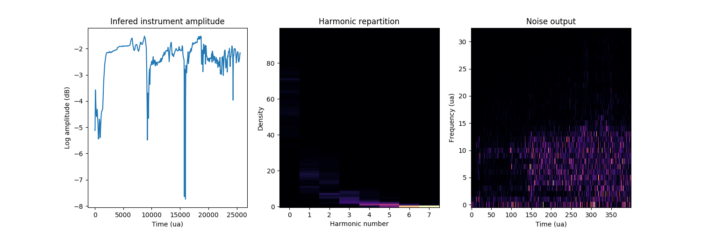

# Differentiable Digital Signal Processing (DDSP) in Pytorch

Implementation of [Differentiable Digital Signal Processing (DDSP)](https://storage.googleapis.com/ddsp/index.html) in Pytorch.

The original paper is available at [https://openreview.net/pdf?id=B1x1ma4tDr](https://openreview.net/pdf?id=B1x1ma4tDr).

This reimplementation was done by [Antoine Caillon](http://github.com/caillonantoine) and [Philippe Esling](http://esling.github.io) at the [IRCAM - ACIDS team](http://acids.ircam.fr)

## Real-time implementation

You can see the real-time PureData + TouchOSC bow made by [Antoine](http://github.com/caillonantoine) in action on [Youtube](https://www.youtube.com/watch?v=U2ZXANU9EQg)

## Examples

Audio examples are available at this repo's page: [https://caillonantoine.github.io/ddsp-recode/](https://caillonantoine.github.io/ddsp-recode/).

## Note

**Note** - This repository is a very in-progress work. Please come back later for more fun.
