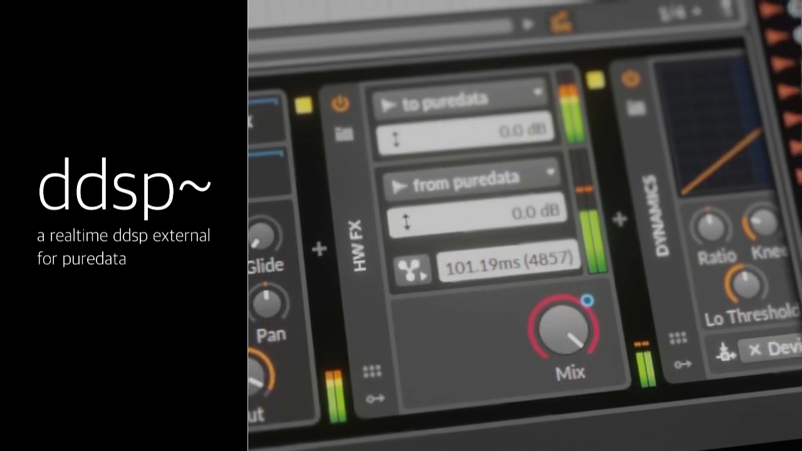

# Differentiable Digital Signal Processing



Implementation of the [DDSP model](https://github.com/magenta/ddsp) using PyTorch. This implementation can be exported to a torchscript model, ready to be used inside a realtime environment (see [this video](https://www.youtube.com/watch?v=_U6Bn-1FDHc)).

## Pretrained models

| instrument | realtime | preprocessing | sampling rate |                                  link                                  |
| :--------: | :------: | :-----------: | :-----------: | :--------------------------------------------------------------------: |
| saxophone  |   true   |  `sigmund~`   |     48kHz     | [download](https://nubo.ircam.fr/index.php/s/7AenL27BEaxLkKi/download) |
|   violin   |   true   |  `sigmund~`   |     48kHz     | [download](https://nubo.ircam.fr/index.php/s/f6XB4Kp9onxiNwZ/download) |
<!-- |   violin   |   true   |    `crepe`    |     48kHz     | [download](https://nubo.ircam.fr/index.php/s/LzTsYr8zdqHYdMy/download) | -->
<!-- |   violin   |  false   |    `crepe`    |     48kHz     | [download](https://nubo.ircam.fr/index.php/s/LMFo3eAb3C5by23/download) | -->


## Usage

Edit the `config.yaml` file to fit your needs (audio location, preprocess folder, sampling rate, model parameters...), then preprocess your data using 

```bash
python preprocess.py
```

You can then train your model using 

```bash
python train.py --name mytraining --steps 10000000 --batch 16 --lr .001
```

Once trained, export it using

```bash
python export.py --run runs/mytraining/
```

It will produce a file named `ddsp_pretrained_mytraining.ts`, that you can use inside a python environment like that

```python
import torch

model = torch.jit.load("ddsp_pretrained_mytraining.ts")

pitch = torch.randn(1, 200, 1)
loudness = torch.randn(1, 200, 1)

audio = model(pitch, loudness)
```

## Realtime usage

**Be sure that the `block_size` defined in `config.yaml` is a power of 2 if you want to use the model in realtime!**

If you want to use DDSP in realtime (yeah), we provide a pure data external wrapping everything. Export your trained model using

```bash
python export.py --run runs/mytraining/ --realtime true
```

This will disable the reverb and enable the use of the model in realtime. For now the external works on CPU, but you can enable GPU accelerated inference by changing `realtime/ddsp_tilde/ddsp_model.h` `DEVICE` to `torch::kCUDA`. Inside Pd, simply send `load your_model.ts` to the `ddsp~` object. The first inlet must be a pitch signal, the second a loudness signal. It can be directly plugged to the `sigmund~` object for real-time timbre transfer.

You can then apply the exported impulse response using a convolution reverb (such as `partconv~` from the `bsaylor` library).

## Compilation

You will need `cmake`, a C++ compiler, and `libtorch` somewhere on your computer. Then, run

```bash
cd realtime
mkdir build
cd build
cmake ../ -DCMAKE_PREFIX_PATH=/path/to/libtorch -DCMAKE_BUILD_TYPE=Release
make install
```

If you already have `pytorch` installed via pip inside a virtual environment, you can use the following `PREFIX_PATH`:

```bash
cmake ../ -DCMAKE_PREFIX_PATH=~/miniconda3/lib/python3.X/site-packages/torch -DCMAKE_BUILD_TYPE=Release
make install
```

By default, it will install the external in `~/Documents/Pd/externals`. 
